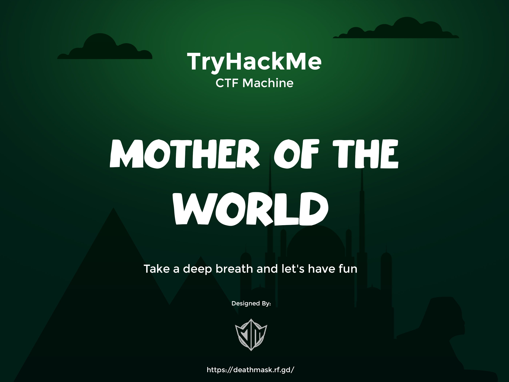

# mother of the world -  tourism website template
mother of the world is a fully responsive tourism website template, responsive for all devices, built using HTML, CSS, and JavaScript.

## Banner

## Prerequisites

Before you begin, ensure you have met the following requirements:

* [Git](https://git-scm.com/downloads "Download Git") must be installed on your operating system.

## Let's solve with us

## Contact

  
  
  
  

## License

MIT
